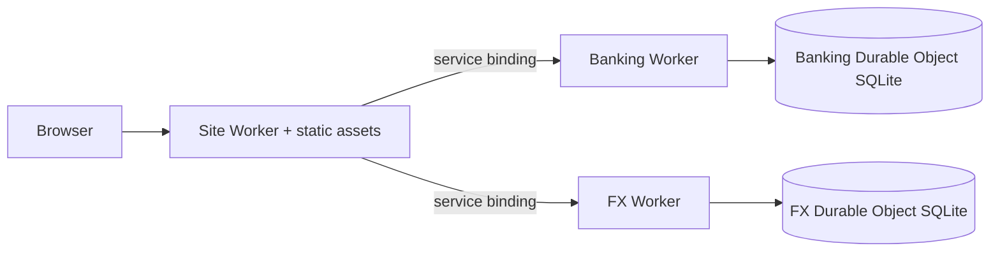
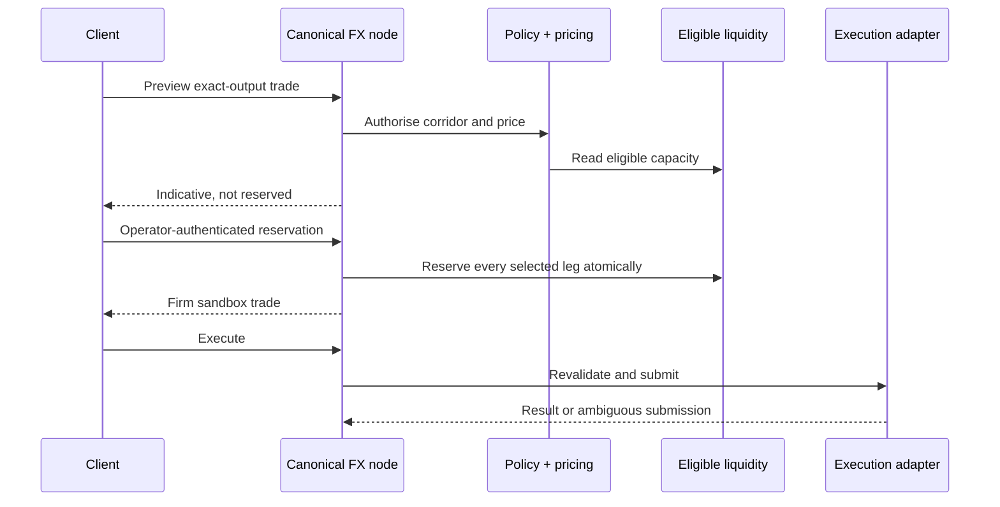

# Architecture

Blueballs is a monorepo with a product demonstrator, a general banking API, a
canonical FX runtime and replaceable integration boundaries.

## System layers

| Layer | Source | Responsibility |
| --- | --- | --- |
| Product demonstrator | `src/`, `workers/site/` | Product narrative, simulated journeys, API catalogue and provider research |
| Banking API | `apps/api/`, `workers/api/` | Tenant product resources, exact ledger, events, webhooks and 174-operation contract |
| Canonical FX node | `apps/fx-node/`, `workers/fx/` | Policy-aware pricing, routing, reservation and settlement lifecycle |
| FX domain packages | `packages/fx-*` | Policy, pricing, liquidity, market, fiat, SDK, simulator and contracts |
| Public contracts | `spec/`, generated OpenAPI | Behaviour, invariants, threat boundaries and extension rules |
| Provider boundary | `docs/partners/`, `src/ecosystem/` | Source-cited research and optional adapter descriptors; no implicit connection |

The historical FX routes under `apps/api/src/routes/` are compatibility
demonstrations. New FX economics and integrations belong in `apps/fx-node` and
`packages/fx-*`.

## Runtime topologies

### Local Node reference

`pnpm dev` starts the Vite site on port 5280, banking API on 5290 and canonical
FX node on 8788. Banking and FX persistence use local SQLite files. This is the
shortest path for contributors and forkers.

### Cloudflare reference

The site Worker owns the public domain and calls the banking and FX Workers over
same-account service bindings. Each API is backed by a SQLite Durable Object.
Native `transactionSync(callback)` is the atomic boundary; transaction-control
SQL is not emulated.

Neither topology is a clustered production-bank data plane. See
[`OPERATIONS.md`](OPERATIONS.md) and [`KNOWN-LIMITATIONS.md`](KNOWN-LIMITATIONS.md).

## Banking ownership and money

Signup creates an opaque `tenant_id`. Authenticated child keys inherit the same
tenant; email remains contact metadata and is never identity proof. Tenant
resources, events, webhook deliveries and idempotency records carry that stable
owner. Cross-tenant reads and mutations resolve as not found or empty results.

Banking amounts enter as base-10 strings, convert to exact minor units and post
through a double-entry transaction. Multi-leg operations—such as credit draw or
repayment—commit in one Node or Durable Object transaction and roll back as a
unit.

## FX lifecycle

Identity, private orders, policy, pricing and route construction remain
off-chain. Solidity contracts optionally constrain backing, authority,
cancellation, replay and atomic token settlement. External fiat edges retain
their real finality and are never described as atomic merely because a token leg
is atomic.

The default runtime intentionally has no execution adapter and fails closed.

## Extension points

- Banking providers implement deployment-owned identity, cards, accounts,
  payments, custody and reporting adapters around the public API contract.
- FX providers implement the interfaces in [`spec/fx/ADAPTERS.md`](spec/fx/ADAPTERS.md)
  without adding vendor semantics to the FX kernel.
- Public API changes update the endpoint catalogue, OpenAPI, executable examples
  and verification gates in the same commit.
- Provider names belong in the research directory and provider documents unless
  a separately tested optional adapter exists.

## Security boundaries

Public, tenant, operator and global-read access classes are declared for every
banking operation and checked against the router. Shared-host webhook delivery
is disabled. Self-hosted webhook egress is HTTPS-only, exact-host allowlisted,
redirect-free and concurrency bounded. Read [`SECURITY.md`](SECURITY.md) and
[`spec/fx/THREAT-MODEL.md`](spec/fx/THREAT-MODEL.md) before changing a trust
boundary.
