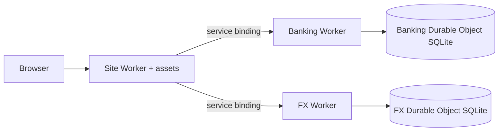
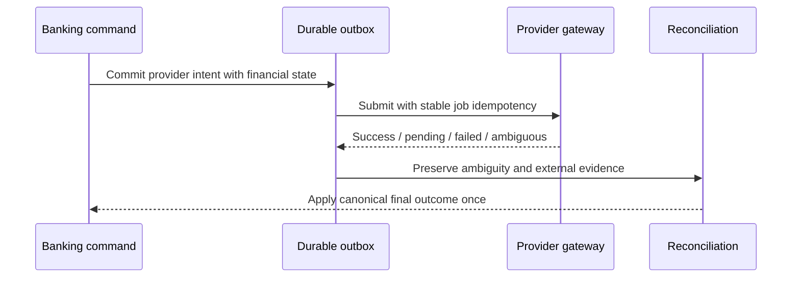
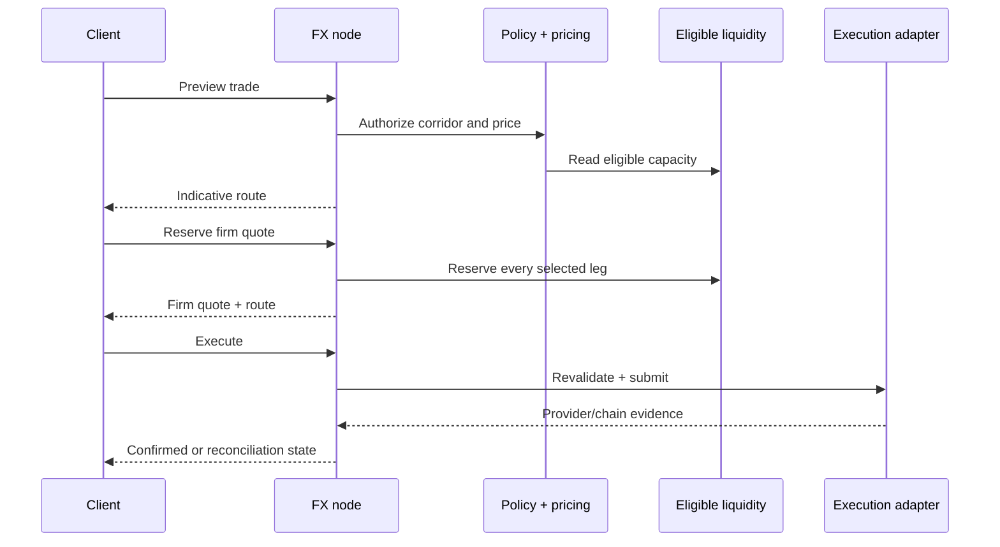

# Architecture

Blueballs is a monorepo for building and operating modern financial institutions. Product interfaces, banking, provider orchestration, FX, smart contracts and cloud runtimes share one set of machine-readable financial contracts.


## System layers

| Layer | Source | Responsibility |
| --- | --- | --- |
| Product operating layer | `src/`, `workers/site/` | Product interfaces, Sandbox Builder, architecture labs, API catalogue and provider directory |
| Banking core | `apps/api/`, `workers/api/` | Tenant resources, exact ledger, provider orchestration, events, webhooks, audit and 181-operation contract |
| Canonical FX runtime | `apps/fx-node/`, `workers/fx/` | Policy, pricing, routing, reservation, execution and settlement lifecycle |
| FX domain packages | `packages/fx-*` | Policy, pricing, liquidity, market, fiat, monetary, SDK, simulator and contracts |
| Public contracts | `spec/`, generated OpenAPI | Behaviour, invariants, ownership and extension rules |
| Provider boundaries | banking gateway + FX adapters | Institution-owned banks, rails, identity, custody, liquidity and execution providers |

Banking-compatible FX endpoints remain in the banking catalogue, while canonical FX economics and settlement ownership live in `apps/fx-node` and `packages/fx-*`.

## Runtime topologies

### Node

`pnpm dev` starts the site on 5280, banking API on 5290 and FX node on 8788. Banking and FX use local SQLite stores for the self-hosted reference topology.

### Cloudflare

The site Worker owns the public domain and routes Banking and FX over same-account service bindings. Authoritative financial state lives in SQLite Durable Objects and background provider/webhook work resumes through alarms.



### Production provider composition

The banking core speaks one provider-neutral gateway contract for payments, receiving details, cards, identity and custody.

The FX node supports deployment runtime composition:

```bash
FX_NODE_MODE=production \
FX_NODE_PRODUCTION_ADAPTER=@institution/blueballs-fx-runtime \
FX_NODE_API_KEY='32-or-more-characters' \
node apps/fx-node/src/cli.js
```

The adapter supplies institution market/liquidity, quote persistence/lifecycle, fiat evidence and execution while Blueballs keeps the canonical API, policy and finality model.

## Banking ownership and money

Signup/bootstrap creates an opaque `tenant_id`. Authenticated child credentials inherit the tenant; contact metadata is never identity authority.

Tenant resources, events, provider work and idempotency records carry the stable principal. Cross-tenant reads and mutations resolve as not found or empty results.

Amounts enter as base-10 strings, convert to exact minor units and post through the double-entry ledger. Multi-leg commands commit one Node or Durable Object transaction and roll back as a unit.

Balances are derived by summing postings rather than stored separately. The posting boundary enforces two invariants:

1. transaction legs sum to zero;
2. customer accounts cannot finish below zero.

System-side accounts use explicit namespaces such as `clearing:*`, `external:*`, `lp:*` and `principal:*`.

## Banking command lifecycle

```text
request
  → auth / authorization
  → lifecycle preflight
  → domain state transition
  → ledger postings
  → events + durable outboxes
  → idempotency result
  → audit correlation
  → local commit
```

Authentication, authorization and route-specific authority checks occur before idempotent replay. External work begins only from durable state after the local command is committed.

## Sandbox Builder boundary

`src/sandbox/` owns the Brief → Blueprint → Build → Test → Launch product flow. Trusted API routes own persistent projects and tenant-isolated journeys.

The builder can shape presentation, journeys, brands, product rules and adapter selections while financial authority remains in the ledger, provider and FX runtimes.

## Provider lifecycle



Provider payloads and webhook signing material are sealed with AES-256-GCM before persistence. Signed inbound settlement uses an independent HMAC boundary and durable replay identities.

## FX lifecycle



Identity, private orders, policy, pricing and route construction stay off-chain. The optional Solidity kernel constrains token backing/accounting, authority, cancellation, replay and atomic token settlement.

Fiat/provider edges keep their own finality rather than being collapsed into the token transaction.

## Scale model

The current banking correctness model uses one authoritative serialized writer per SQLite-backed shard. Scale-out is by institution/tenant shard ownership, principal routing and explicit cross-shard settlement orchestration rather than unsynchronized writers over one mutable state view.

See [`docs/SCALING.md`](docs/SCALING.md).

## Extension rules

- Banking providers implement the versioned gateway capability contract.
- FX deployments implement [`spec/fx/ADAPTERS.md`](spec/fx/ADAPTERS.md).
- Public API changes update contracts, OpenAPI, examples and verification together.
- Provider-specific credentials/commercial assumptions stay outside canonical domain logic.
- Financial changes add invariant and failure-path proof.

## Release assurance

The architecture is verified through the repository:

```bash
pnpm verify
pnpm verify:release
```

The full release profile covers banking lifecycle success, tenant isolation, restart/eviction, migrations, provider finality/reconciliation, FX, Foundry fuzz/invariants, recovery, load/chaos, dependency inventory and container scanning.

Read [`PRODUCTION-HARDENING.md`](PRODUCTION-HARDENING.md), [`SECURITY.md`](SECURITY.md) and [`OPERATIONS.md`](OPERATIONS.md) for the assurance and operating model.
