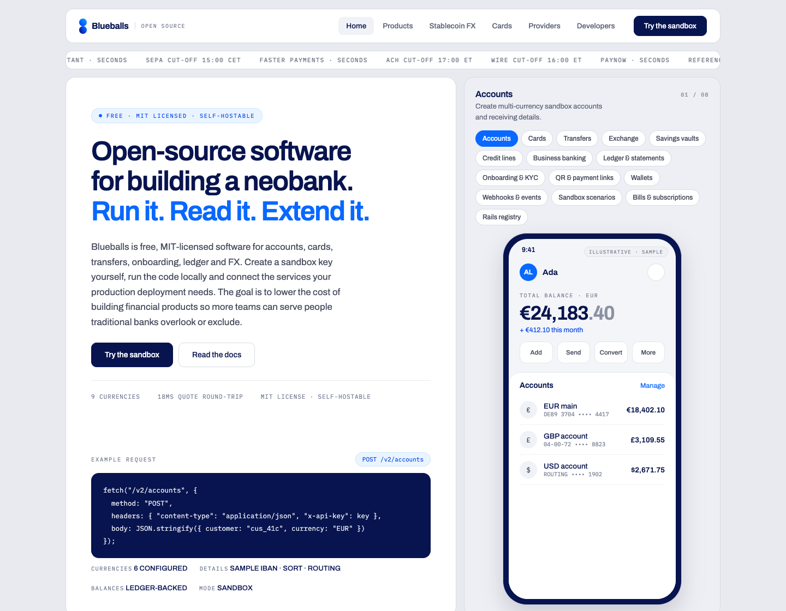
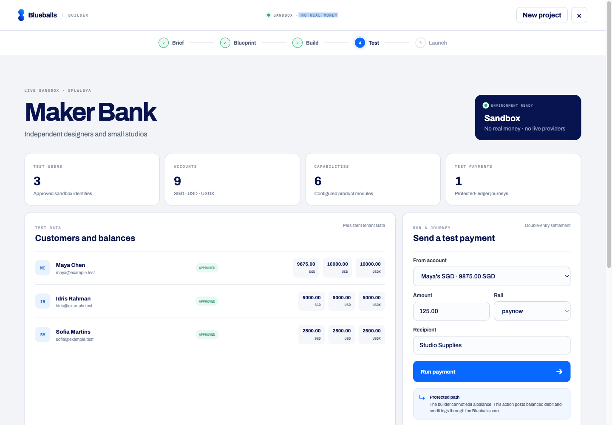
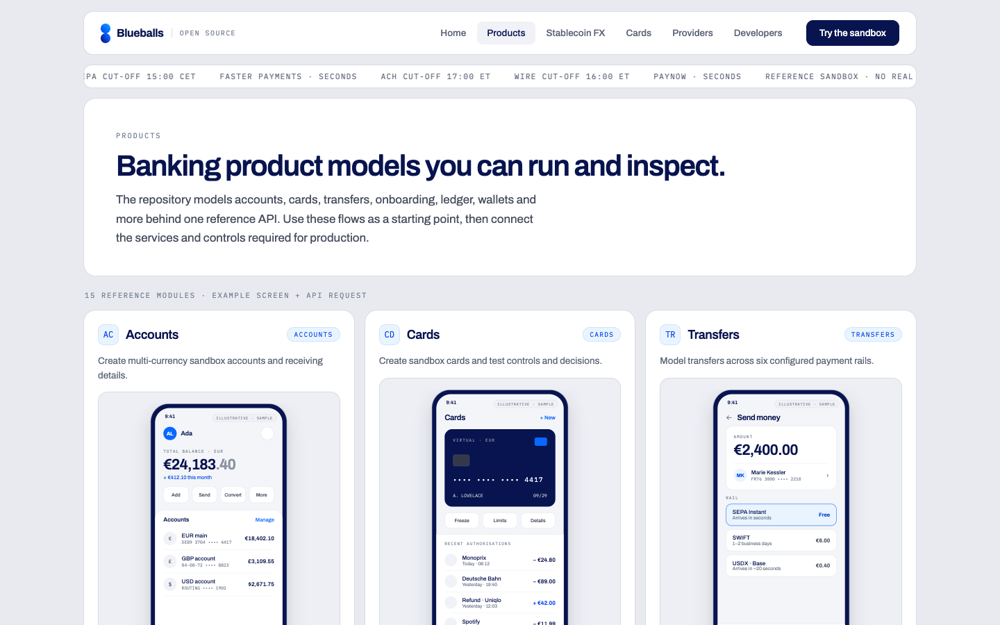
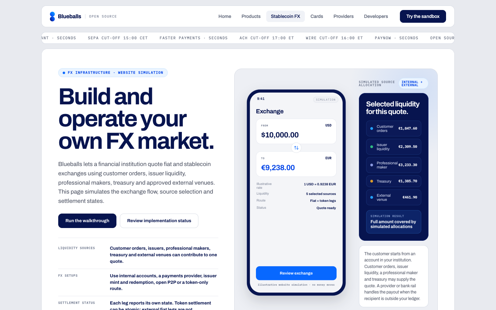
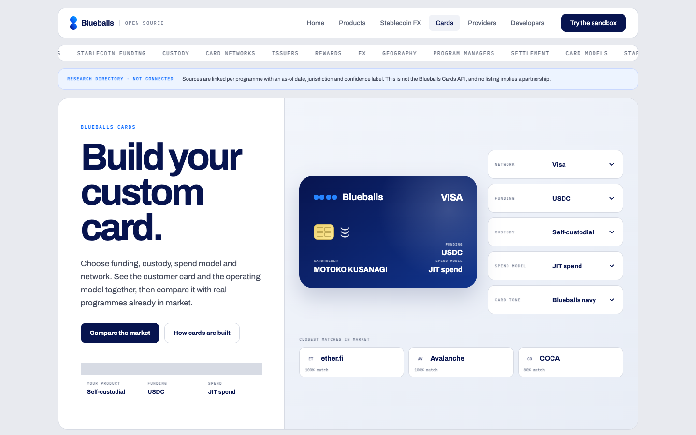
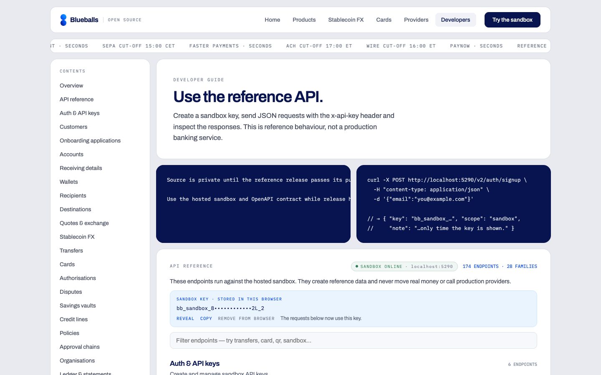
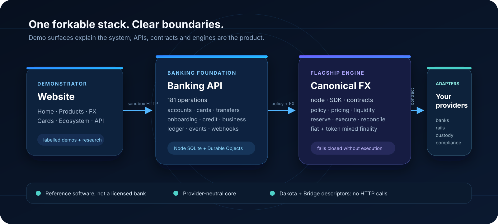
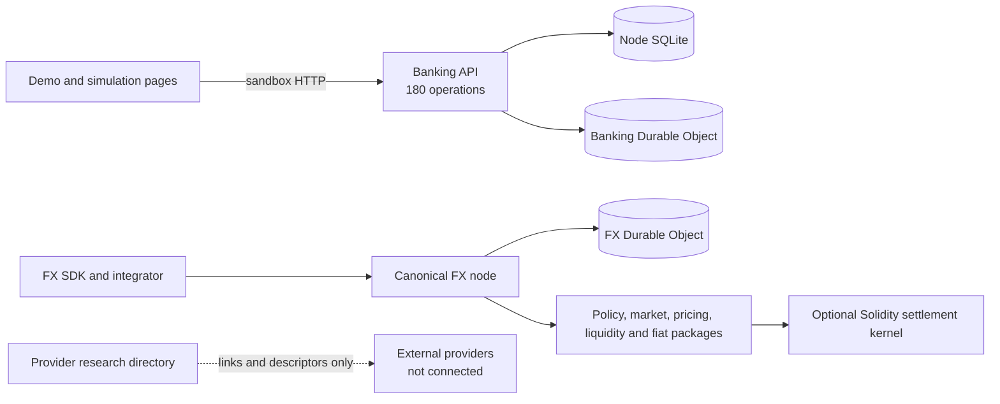
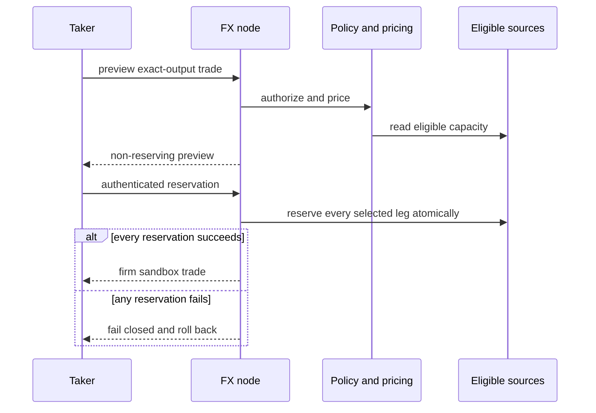

<h1 align="center">
  
  Blueballs
</h1>

<p align="center">
  <strong>Open-source software for building a neobank.</strong>
</p>

<p align="center">
  Run it. Read it. Extend it. Connect the banks, rails and providers you choose.
</p>

<p align="center">
  <a href="https://blueballs.tech">Website</a> ·
  <a href="https://blueballs.tech/products">Products</a> ·
  <a href="https://blueballs.tech/fx">FX</a> ·
  <a href="https://blueballs.tech/cards">Cards</a> ·
  <a href="https://blueballs.tech/developers">API</a> ·
  <a href="docs/partners/README.md">Providers</a>
</p>

<p align="center">
  
</p>

Blueballs is an MIT-licensed, self-hostable **neobank reference stack**: product screens, a 180-operation banking API, a double-entry ledger, and a canonical FX engine.

Fork it, run it locally, hit the sandbox API, then replace reference adapters with the providers your deployment needs. It is software for founders building a bank, neobank, embedded-finance product or stablecoin-enabled product — not a licensed bank, and not a live Dakota or Bridge integration.

## Design, build and test a product

[](https://blueballs.tech/sandbox)

Open the **Sandbox Builder** and describe the financial product you want to
create. Blueballs turns the brief into a structured blueprint, provisions an
isolated tenant environment with test users and multi-currency accounts, then
lets you settle a test payment through the protected double-entry ledger.

The builder is free through 10,000 active users, uses bring-your-own AI, and
keeps external provider costs separate. It moves no real money and connects no
live bank, card, identity or wallet provider. Start at `/sandbox` or follow the
complete [`SANDBOX.md`](SANDBOX.md) product and API guide.

## See the stack

Blueballs brings the product model, API surface and FX infrastructure into one
forkable reference project. These are deliberately cropped, readable views of
the real demonstrator—not design mock-ups.

| Banking product models | Stablecoin FX market |
| --- | --- |
| [](https://blueballs.tech/products) | [](https://blueballs.tech/fx) |
| Custom card builder | Developer API |
| [](https://blueballs.tech/cards) | [](https://blueballs.tech/developers) |

The [README crop manifest](docs/assets/readme/README.md) records how these views
were derived. Full-page desktop and mobile captures remain available as
[QA evidence](docs/assets/screenshots/README.md), but are intentionally not
rendered here. Screenshots do not claim that an external provider is connected.

## What is included

### Banking foundation

- multi-currency accounts;
- cards and controls;
- transfers and rail metadata;
- onboarding and identity workflows;
- savings, credit and business-banking primitives;
- double-entry ledger and event history;
- product screens, journeys and executable API documentation.

All 180 catalogued banking operations have an explicit access class and machine-readable contract. They are reference implementations, not production-provider integrations. Consumer iOS and Android applications are not included.

### Canonical FX foundation

The canonical FX implementation lives in `apps/fx-node` and the `packages/fx-*` packages. It includes:

- institution policy, participants, credentials and short-lived authorisations;
- signed private customer or member liquidity;
- issuer, institutional LP, other-institution and treasury adapters;
- deterministic reference-price consensus;
- bank-principal pricing and hard balance-sheet limits;
- exact-output multi-source optimisation;
- all-leg reservation before a quote becomes firm;
- mixed fiat and token settlement states;
- Solidity Vault, settlement, cancellation, policy registry and AtomicRouter contracts;
- typed JavaScript SDK, OpenAPI contract and deterministic simulator;
- unit, integration, fuzz, invariant, controlled-EVM and Docker release gates.

## Reference FX lifecycle

The browser page simulates one BRL to EUR customer request using deterministic
data. The separately runnable FX node implements the canonical server-side
lifecycle; the page does not call it or reserve liquidity.

```text
BRL through an attested PIX-style payment
    → BRLX
    → policy-approved, multi-source BRLX/EURC token FX
    → EURC issuer redemption
    → EUR
```

The customer sees one exchange. The institution can inspect which sources were eligible, which were excluded, the selected allocation, principal risk and the finality of every settlement leg.

The reference token market can combine:

```text
private customer liquidity
issuer liquidity
another financial institution
institutional LP liquidity
bank treasury
bank principal
```

A preview reads current policy-approved capacity but reserves nothing. A firm sandbox trade is returned only after every selected source and principal risk capacity has been reserved.

## Honest status

- The local reference market and provider inventory are deterministic adapters, not live commercial providers.
- The default FX node has **no execution adapter**. Execution fails closed with `EXECUTION_UNAVAILABLE`; it never invents a transaction hash.
- The Solidity kernel has internal unit, fuzz, invariant and controlled-Anvil execution evidence. This is not an independent audit or production-mainnet proof.
- Fiat payment and redemption legs are not made atomic by the token leg. The BRL to EUR route is correctly classified as `MIXED_FINALITY`.
- The Node reference uses SQLite. The Cloudflare reference uses Durable Object
  SQLite with native synchronous transactions. Neither is a clustered
  production-bank data plane.
- This repository ships software, not a bank, licence, insured account or regulated financial service.

See `spec/fx/KNOWN-LIMITATIONS.md` and `SECURITY.md` before deploying anything beyond local evaluation.

## Quickstart

Requires Node **24.15+** and pnpm.

```bash
git clone https://github.com/Josh-Gi3r/blueballs.git
cd blueballs
pnpm install
pnpm dev
```

This starts:

- site: `http://localhost:5280`
- banking API: `http://localhost:5290/v2`
- canonical FX node: `http://localhost:8788`
- local FX key: `bb_test_local_fx`

Open `http://localhost:5280/fx`. The page is a labelled, deterministic browser
simulation for explaining pricing, policy and source-capacity decisions. It does
not call the FX node, reserve liquidity or execute a trade.

Run individual services:

```bash
pnpm dev:site
pnpm dev:api
pnpm dev:fx
```

Run a complete banking journey against the local API:

```bash
node examples/banking-quickstart.mjs http://localhost:5290
```

The executable example signs up a tenant, creates a business customer and USD/EUR
accounts, funds USD, executes a held FX quote between the accounts, then reads the
resulting balances and ledger. The same file is exercised against a clean API by
the banking test suite, so the quickstart cannot silently drift from the product.

### Cloudflare preview and deployment

The hosted reference stack runs at `https://blueballs.tech`. Cloudflare serves
the Vite site and routes the banking and FX APIs through same-origin service
bindings, with Durable Object SQLite storage behind both services.

```bash
# Cloudflare-flavoured local preview
pnpm preview:cloudflare

# Upload a shareable preview version without changing production
pnpm preview:upload

# Build and deploy the site plus both APIs
pnpm deploy:cloudflare
```

The deployment requires an authenticated Wrangler session. Production and
preview settings live in `wrangler.jsonc`, `wrangler.api.jsonc`, and
`wrangler.fx.jsonc`.

The local Cloudflare preview builds the candidate, then starts the site at
`http://localhost:5380`, the banking Worker at `:5381` and the FX Worker at
`:5382`. Wrangler's local service registry connects both site bindings and both
APIs use local SQLite Durable Objects. Set `FX_API_KEY` to override the local
`bb_test_local_fx` reference key; production still requires a Wrangler secret.

### Docker Compose

```bash
docker compose -f compose.reference.yml up --build
```

The FX databases persist in the `fx-data` volume.

```bash
docker compose -f compose.reference.yml down
```

Use `down -v` only when you deliberately want to remove the seeded reference state.

## Try the public FX trade

Preview without reserving:

```bash
curl -X POST http://localhost:8788/v2/fx/reference/trades/preview \
  -H 'Authorization: Bearer bb_test_local_fx' \
  -H 'content-type: application/json' \
  -d '{"inputAmount":"50000.00","from":"BRL","to":"EUR"}'
```

Reserve the same trade as an operator in a self-hosted environment:

```bash
curl -X POST http://localhost:8788/v2/fx/reference/trades \
  -H "Authorization: Bearer $FX_NODE_API_KEY" \
  -H 'content-type: application/json' \
  -d '{"inputAmount":"50000.00","expiresInMs":60000}'
```

Inspect the public runtime:

```bash
curl -H 'Authorization: Bearer bb_test_local_fx' \
  http://localhost:8788/v2/fx/reference/status
```

Scenario changes, reservations, releases and execution are operator mutations.
They are unavailable without the runtime API key; self-hosters must replace the
local test value and must not expose the real credential in browser code or
public examples. Cloudflare stores the equivalent as the `FX_API_KEY` secret.

The complete REST contract is available at:

```text
apps/fx-node/openapi.yaml
http://localhost:8788/openapi.yaml
```

## Architecture







```text
blueballs/
├─ src/                         website, product UI and live API documentation
├─ apps/api/                    general banking API and double-entry ledger
├─ apps/fx-node/                canonical self-hostable FX runtime
├─ packages/
│  ├─ fx-contracts/             Vault, settlement, cancellation, policy registry, router
│  ├─ fx-market/                private signed orders, reservations and reconciliation
│  ├─ fx-pricing/               exact arithmetic, reference consensus, risk and principal pricing
│  ├─ fx-liquidity/             cross-source optimisation and reservation coordination
│  ├─ fx-policy/                participants, credentials, accounts and authorisations
│  ├─ fx-fiat/                  fiat intents, attestations, finality and settlement graph
│  ├─ fx-sdk/                   typed dependency-free JavaScript client
│  └─ fx-simulator/             deterministic economic and failure scenarios
├─ spec/fx/                     architecture, threat model, invariants and release contracts
└─ scripts/dev.mjs              starts site, banking API and FX node together
```

Identity, policy, private orders, pricing and route construction remain off-chain. The contract kernel constrains token backing, maker and taker authority, cancellation, replay, live institution policy and atomic settlement.

## Canonical versus legacy FX

`apps/fx-node` and `packages/fx-*` define all new FX economics, policy, risk, routing and public claims.

The older FX routes under `apps/api/src/routes/` are frozen compatibility demonstrations. They are not the source of truth and must not receive new FX features. See `spec/fx/LEGACY-MIGRATION.md`.

## Verification

The aggregate FX release gate covers:

- market, policy, pricing, liquidity, fiat, SDK, node and simulator tests;
- Solidity format, build, unit tests, fuzzing and invariants;
- controlled EVM execution through Anvil;
- self-hosted Docker image build;
- complete reference-stack build;
- TypeScript and Vite production build.

Internal green gates prove the tested reference behaviour. They do not replace independent security review or production operating controls.

Run the local gate with `pnpm verify`. It exercises the banking API, every FX
package, Workers/Durable Object runtime tests, catalogue and OpenAPI drift,
contract lint, SDK package boundaries, the complete Foundry contract gate and
Compose configuration validation. Docker image builds remain a release-machine
check because they require a running daemon.

## What works today

| Surface | Status | Evidence boundary |
| --- | --- | --- |
| Banking API | Reference implementation | 180 access-classified operations; tenant-isolation tests |
| Cloudflare banking runtime | Reference implementation | Durable Object transaction and restart tests |
| Canonical FX node | Reference implementation | Public preview; authenticated state changes; fail-closed execution |
| FX packages and SDK | Implemented | Unit/integration tests and five-file SDK tarball boundary |
| Solidity kernel | Internally tested | Unit, fuzz and invariant evidence; no independent audit |
| Product, FX and Cards pages | Demonstrations/research | No real-money movement; FX is a browser simulation |
| Dakota and Bridge | Included descriptors; not connected | Source-cited capability mappings; zero HTTP calls |
| Other provider listings | Link only | Research directory; no relationship or integration claimed |

## Documentation

| Start here | Purpose |
| --- | --- |
| [`VISION.md`](VISION.md) | Product thesis, principles and boundaries |
| [`ARCHITECTURE.md`](ARCHITECTURE.md) | System layers, data ownership, runtimes and extension points |
| [`OPERATIONS.md`](OPERATIONS.md) | Local, Docker and Cloudflare operation; backup and rollback |
| [`TESTING.md`](TESTING.md) | Complete gate, focused checks and evidence rules |
| [`KNOWN-LIMITATIONS.md`](KNOWN-LIMITATIONS.md) | Banking, provider, runtime, FX and release limitations |
| [`CONTRIBUTING.md`](CONTRIBUTING.md) | Contract-safe contribution workflow |
| [`SECURITY.md`](SECURITY.md) | Private reporting and production security requirements |
| [`GOVERNANCE.md`](GOVERNANCE.md) | Decision ownership and compatibility policy |
| [`CODE_OF_CONDUCT.md`](CODE_OF_CONDUCT.md) | Community expectations and enforcement |
| [`RELEASE.md`](RELEASE.md) | Reproducible release procedure and artefact bundle |
| [`SANDBOX.md`](SANDBOX.md) | Builder journey, API, trust boundary and provider model |

### Builder guides

- [`apps/api/README.md`](apps/api/README.md) — banking runtime and tenant boundary
- [`apps/fx-node/README.md`](apps/fx-node/README.md) — run and inspect the canonical FX node
- [`packages/fx-sdk/README.md`](packages/fx-sdk/README.md) — use the FX SDK
- [`spec/fx/PUBLIC-REFERENCE.md`](spec/fx/PUBLIC-REFERENCE.md) — FX public product and evidence contract
- [`spec/fx/ADAPTERS.md`](spec/fx/ADAPTERS.md) — replace reference providers
- [`packages/fx-contracts/DEPLOYMENT.md`](packages/fx-contracts/DEPLOYMENT.md) — contract deployment and binding order
- [`docs/partners/README.md`](docs/partners/README.md) — relationship and technical-maturity rules
- [`docs/partners/DAKOTA.md`](docs/partners/DAKOTA.md) and [`docs/partners/BRIDGE.md`](docs/partners/BRIDGE.md) — source-cited capability mappings, not integrations

## Contributing

Read `CONTRIBUTING.md` before changing banking or FX contracts.

## Licence

MIT. See `LICENSE` and `THIRD_PARTY_NOTICES.md`.
